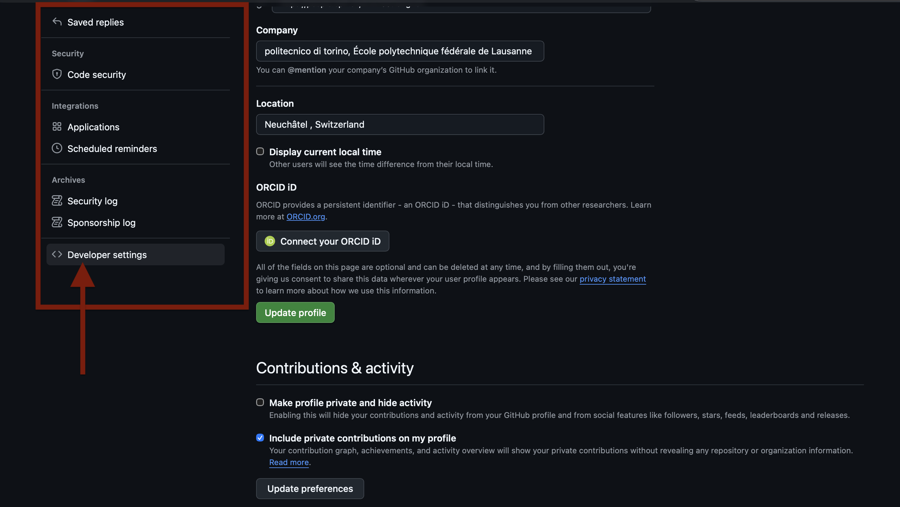
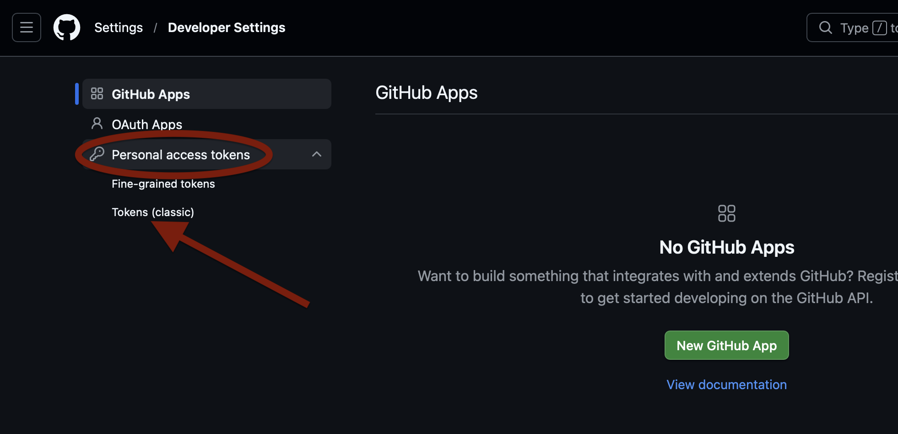
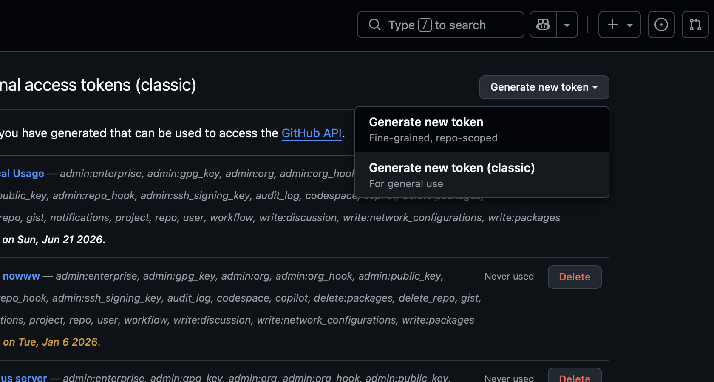
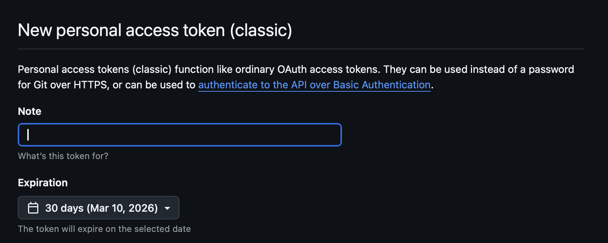
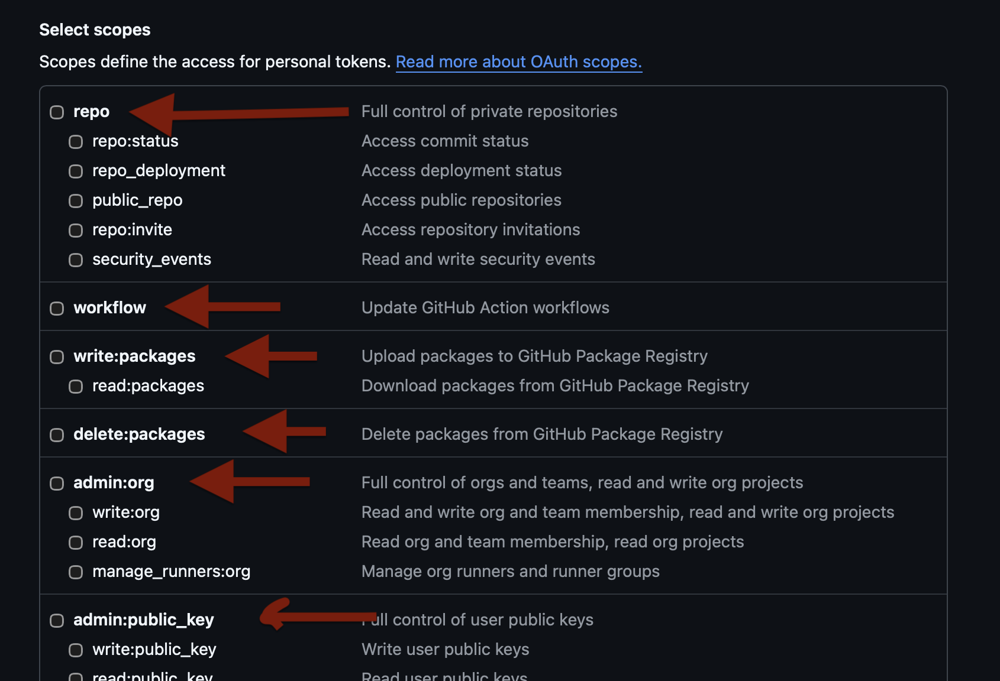
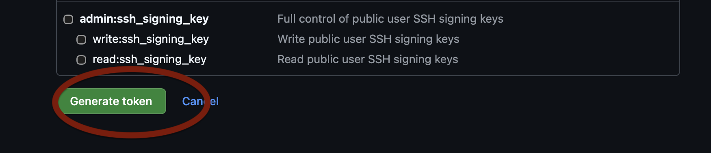

# Git tutorial

Ghabl az in file , shoma bayad file **1_CLI.md** ro dide bashid.


----------------
## Introduction (Moghadam) 

Ta inja ma ba CLI yad gereftim  ke chijori berim bebinim kojaeim, varede folder beshim , back bezanim , folder besazim, file besazim, too file benvisim , tooye folder bebinim chia hast, tooye file bebinim chia hast , file ro mohtaviatesho bbin, hazf konim file , hazf konim folder, mohit besazam, mohito activate konim , va hamchnin yek file python ro run bznim 


hala mikham yek porozhe (project) besazam, pas yek folder misazam bename project1 va dakhelesh miram va 2 ta file misazam bename a1.py va a2.py

va miram tooye a1.py o a2.py code mizanam.


```bsh
(base) apm@APMs-MacBook-Pro desktop % pwd
/Users/apm/desktop

(base) apm@APMs-MacBook-Pro desktop % mkdir project1

(base) apm@APMs-MacBook-Pro desktop % cd project1

(base) apm@APMs-MacBook-Pro project1 % pwd
/Users/apm/desktop/project1

(base) apm@APMs-MacBook-Pro project1 % ls

(base) apm@APMs-MacBook-Pro project1 % touch a1.py

(base) apm@APMs-MacBook-Pro project1 % vim a1.py

(base) apm@APMs-MacBook-Pro project1 % cat a1.py
print('salam')

(base) apm@APMs-MacBook-Pro project1 % vim a2.py

(base) apm@APMs-MacBook-Pro project1 % ls
a1.py	a2.py

(base) apm@APMs-MacBook-Pro project1 % cat a2.py
print('salam dostan khobid?')

```


bad az gozashte zaman , miam dobare a1.py ro taghir midam bejaye ye print(salam) e sade, omadam codesh ro khafan tar kardam.


```bsh
(base) apm@APMs-MacBook-Pro project1 % cat a1.py
answer = input('aya shoma run mikonid? (y/n)')


if answer.lower().strip()=='y':

	for i in range(0,100):
		print('salam')
else:
	print('khodafez')%     

```


runesh mikoni


```bsh
(base) apm@APMs-MacBook-Pro project1 % pwd
/Users/apm/desktop/project1

(base) apm@APMs-MacBook-Pro project1 % ls
a1.py	a2.py

(base) apm@APMs-MacBook-Pro project1 % python3 a1.py
aya shoma run mikonid? (y/n)n
khodafez

(base) apm@APMs-MacBook-Pro project1 % python3 a1.py
aya shoma run mikonid? (y/n)y
salam
salam
salam
salam
salam
salam
salam
salam
...

```

dobare miam file a2.py ro taghir dadam bejaye yek chize sade, oomadam az yek loop o repeat o in chiza estefade krdm 


```bsh
(base) apm@APMs-MacBook-Pro project1 % python3 a2.py
aya shoma run mikonid? (y/n)y
salam
salam
salam
salam
salam

(base) apm@APMs-MacBook-Pro project1 % python3 a2.py
aya shoma run mikonid? (y/n)n
khodafez
khodafez
khodafez
khodafez
khodafez

```


Be koja mikhahim beresim? bahs ine ke baraye yek porozheye sade dah ha file ma misazimo har kodom ro chandin bar taghir midahim.


ey kash mitonestam az aval ke har file misakhtam, etealaatesho zakhire dashtam, har file che kari kardam , comment mizashtam, tarikh dasht , ey kash aslan mitonestam bargardam b verzhene 10 daghigheye ghabl ( agar jaei eshtebah kardam)


Yek chizi mesle :

20:30 14 mordad , folder project1 -->comment : besmella shoroe prozhe

20:35 a1.py ro sakhti k khalie --> coment : avalin file khalie a1 

20:37 --> a1.py --> print('salam') -->comment : aval mikhastaj check konim

project managmement (modiriate porozhe) mikrdi


Ali , danial , mohsen

20:30 14 mordad , Ali --> folder project1 -->comment : besmella shoroe prozhe


20:35  mohsen --> a1.py ro sakhti k khalie --> coment : avalin file khalie a1 

20:37 --> danial --> a1.py --> print('salam') -->comment : aval mikhastaj check konim


----------------
## Git Emergence (Zohoore GIT)

Linus trovalds (finnish-american scientist) oomad baraye ye porozhe e mizad , oon porozhe ro contorl kone ba refighesh --> git ro sakht.


hich chizi hich codi ,hcih sazmani hich chzii bedone git ghabele control nist.


abzari misazam (tool) -> Git --> in miad system version controlling --> miad baraye shoma yek folder ro mispari behesh miad onja shoro mikone va har taghiri ro negah midare va sabt mikone

hamaro time mzine, taghirato minevisi , user ,

badesh omad --> barnagardim b version 4 roz pish --> chra natonm file amo taghir bdmn

branch (shakhe bezanam) movazi kar konam va .. koli ghabeliat


(Open source) yani matn baz hast


Esme Linus ke yek system amel hast (Operating system (OS)) az khode linus (sazande ye git omd) . Linux || Linus

bbin cheghadr khafane tamame abar computer, seevrea , harchizi ---> Blaaye 90% roye linux hast


open source -> distribution mokjtalef --> GUI ,,....


----------
----------
----------
# Nasbe Git (windows , Mac)


### Mac Install ---> 

terminalo miari bala toosh minevisi 
```bsh
brew install git
```

brew--> abzare migi agha install kon  git ro


age error dad o ghermez nevesht k brew ro nadari bayad aval abzare **brew** ro nasb koni

```bsh
/bin/bash -c "$(curl -fsSL https://raw.githubusercontent.com/Homebrew/install/HEAD/install.sh)"

```

chan daghigeh tool mikeshe brew ro mirize --> baraye mac --> abzar downloade abzar hast. badesh ino mizani


```bsh
brew install git
```


baraye inke motmaen shi k git nasb shode kafie bezani : 

```bsh
git --version
```


###  baraye **windows**

Avaal miri too in website 

https://git-scm.com

mizani install for windows -->  download mikoni

miri jaei ke download shode va doone done gozine next next mizani ta install beshe ( age sakhtete boro youtube va search bezan tarigheye nasbesho)

vasate nasb age gozine oomad --> Kodom IDE(editor)--> mitoni bezani VS Code


Bad az inke nasb moafagh anjam shod . mitoni beri samte chap paein


dakhele start menu(samte chap) --> Git bash --> esme appete


toosh minevsii

```bsh
git --version
```


age versiono inaro behet dad yani doros nasb shode


----------
----------
----------
# Amoozeshe Git


Pas ghabl az inke bekhahid yad begirid k Git che shekli hast , shoma bayad aval dakhele terminal ya git bsh benevisid

```bsh
git --version
```

va agar version dad khialeton rahat bashe ke git ro nasb kardid va edame bedid b amoozeshetoon


----
## git init 

yek projhect misazam bename project_f --> fresh -->taze

```bsh
(base) apm@APMs-MacBook-Pro desktop % pwd
/Users/apm/desktop
(base) apm@APMs-MacBook-Pro desktop % mkdir project_f
(base) apm@APMs-MacBook-Pro desktop % cd project_f
(base) apm@APMs-MacBook-Pro project_f % pwd
/Users/apm/desktop/project_f

```

mikham begam k agha lotfan foldere mano negahbani kon azash --> chashm , hamechizo check kon


folder ro management (modiritaesho) dsaste git


```bsh
(base) apm@APMs-MacBook-Pro project_f % git init
Initialized empty Git repository in /Users/apm/Desktop/project_f/.git/

```

git init --> toye fodleri k mikhahi kolesho manage koni


miad yek file msiaze bename .git


initial -> shoro


chizhae mesle .git .gitignore .env .env_exampl .claud ,... -- nemiare too ls , fgth bayad cat

```bsh
(base) apm@APMs-MacBook-Pro project_f % ls  
```


```bsh
(base) apm@APMs-MacBook-Pro project_f % cd .git
(base) apm@APMs-MacBook-Pro .git % ls
HEAD		hooks		refs
config		info
description	objects

```


```bsh
(base) apm@APMs-MacBook-Pro project_f % pwd
/Users/apm/desktop/project_f

```


yek file besaz
```bsh
(base) apm@APMs-MacBook-Pro project_f % touch a1.py
(base) apm@APMs-MacBook-Pro project_f % ls
a1.py
```

----
## git status 

ch chizhaee taghir krdn ya sakhte shodn ya remove shodan , shoma inaro sabt nakardid 


```bsh
(base) apm@APMs-MacBook-Pro project_f % git status
On branch main

No commits yet

Untracked files:
  (use "git add <file>..." to include in what will be committed)
	a1.py

nothing added to commit but untracked files present (use "git add" to track)

```

mige tooye branch (shakhe aslit) , no commit --> commit sabt nashdoe, untracked file --> man in aro track (taghir,sakhtre , hazf)


biam track --> staging (mesle sabade kharid)


```bsh
(base) apm@APMs-MacBook-Pro project_f % git add a1.py
```

yani file a1.py ro briz too sabade stage


```bsh
(base) apm@APMs-MacBook-Pro project_f % git status
On branch main

No commits yet

Changes to be committed:
  (use "git rm --cached <file>..." to unstage)
	new file:   a1.py
```


Untracked   --(git add)---> Stage ---(git commit)-> Commit mishan

hazf shode     tracked       sabt shodan <br>
ezafe shod
taghir    


git status --> file --> a1.py --> untracked 


git add a1.py --> beriz too stage


az stag e--> comit (sabt konm)


git commit -m 'tozih'

```bsh
(base) apm@APMs-MacBook-Pro project_f % git commit -m 'ebtedaei file a1 ro sakhtam'
[main (root-commit) 3cd82c4] ebtedaei file a1 ro sakhtam
 1 file changed, 0 insertions(+), 0 deletions(-)
 create mode 100644 a1.py

```


```bsh
(base) apm@APMs-MacBook-Pro project_f % git status
On branch main
nothing to commit, working tree clean

```


raftam a1.py taghir dadam


git status mizni bbini chekhaabre

```bsh
(base) apm@APMs-MacBook-Pro project_f % git status
On branch main
Changes not staged for commit:
  (use "git add <file>..." to update what will be committed)
  (use "git restore <file>..." to discard changes in working directory)
	modified:   a1.py

no changes added to commit (use "git add" and/or "git commit -a")
(base) ap

```

a1.py taghir dade shdoe --> Untracked


har zaman taghgiram tamom 

git add --> stage
git commit --> sabt (comment)

```bsh
(base) apm@APMs-MacBook-Pro project_f % git add a1.py
(base) apm@APMs-MacBook-Pro project_f % git status
On branch main
Changes to be committed:
  (use "git restore --staged <file>..." to unstage)
	modified:   a1.py

(base) apm@APMs-MacBook-Pro project_f % git commit -m 'print salam ro ezafe krdm b a1'
[main 1ec8841] print salam ro ezafe krdm b a1
 1 file changed, 1 insertion(+)

```


avale foldereton --> git init --> baraye yekbar

too laptob hexzaran folder darid , hame fodlera daran kareshono mikonan

cd --> fodler --> yekbar fght bnvisid git init --> git oono tahte nazar migire


git status --> git add . ---> git commit -m ''


----
## git log

mikhahi tarikhche ro bbini --> git log


```bsh
(base) apm@APMs-MacBook-Pro project_f % git log
commit 1ec8841aefdddcb7c94bdabb562016cb37d7941a (HEAD -> main)
Author: APMaii <ali.pilehvarmeibody@studenti.polito.it>
Date:   Wed Aug 5 21:29:48 2026 +0330

    print salam ro ezafe krdm b a1

commit 3cd82c4f0d4adc81a398b4be956d536d74b3a5f0
Author: APMaii <ali.pilehvarmeibody@studenti.polito.it>
Date:   Wed Aug 5 21:27:47 2026 +0330

    ebtedaei file a1 ro sakhtam

```


ye adad hash --> in adad unique yekta baraye in karie k anjam dadam (shomare meli)


mikhahim oon taghiro bbinim az git diff estefade mikonim

```bsh
(base) apm@APMs-MacBook-Pro project_f % git diff 3cd82c4f0d4adc81a398b4be956d536d74b3a5f0
diff --git a/a1.py b/a1.py
index e69de29..d504937 100644
--- a/a1.py
+++ b/a1.py
@@ -0,0 +1 @@
+print('salam')
\ No newline at end of file

```


```bsh
(base) apm@APMs-MacBook-Pro desktop % git status
fatal: not a git repository (or any of the parent directories): .git


```


har fodleri b sorate pish farz git negahesh nemikone -> git init bezanid

dastoorate git ro bayad too hamon fodler bznid na bironesh


```bsh
(base) apm@APMs-MacBook-Pro project_f % git status
On branch main
nothing to commit, working tree clean

```

rsaftam a1.py va taghiri dadam --> bznm git status


[untracked] ----(add)---> stage ----(commit) --> committed


```bsh
(base) apm@APMs-MacBook-Pro project_f % git status
On branch main
Changes not staged for commit:
  (use "git add <file>..." to update what will be committed)
  (use "git restore <file>..." to discard changes in working directory)
	modified:   a1.py

no changes added to commit (use "git add" and/or "git commit -a")
```


man ba git add a1.py rikhtmsh too stage, hala status k xadam didma sabz shode yani onjas


```bsh
(base) apm@APMs-MacBook-Pro project_f % git add a1.py
(base) apm@APMs-MacBook-Pro project_f % git status
On branch main
Changes to be committed:
  (use "git restore --staged <file>..." to unstage)
	modified:   a1.py


```

sabt mishe 0--> mkire too history ---> unique id mikhorre, esme , timet mikhore, tozihet

```bsh
(base) apm@APMs-MacBook-Pro project_f % git commit -m '5 bar print salam shod'
[main 381e8b7] 5 bar print salam shod
 1 file changed, 2 insertions(+), 1 deletion(-)
(base) apm@APMs-MacBook-Pro project_f % git status
On branch main
nothing to commit, working tree clean
```


beram tarikhche bbinm


```bsh
(base) apm@APMs-MacBook-Pro project_f % git log
commit 381e8b708ecaa81ebac4e73afbe32c7cc7bf63cc (HEAD -> main)
Author: APMaii <ali.pilehvarmeibody@studenti.polito.it>
Date:   Wed Aug 5 21:36:57 2026 +0330

    5 bar print salam shod

commit 1ec8841aefdddcb7c94bdabb562016cb37d7941a
Author: APMaii <ali.pilehvarmeibody@studenti.polito.it>
Date:   Wed Aug 5 21:29:48 2026 +0330

    print salam ro ezafe krdm b a1

commit 3cd82c4f0d4adc81a398b4be956d536d74b3a5f0
Author: APMaii <ali.pilehvarmeibody@studenti.polito.it>
Date:   Wed Aug 5 21:27:47 2026 +0330
:

```


avalin filam a1.py khali bodde , dota neevshte


```bsh
(base) apm@APMs-MacBook-Pro project_f % git diff 3cd82c4f0d4adc81a398b4be956d536d74b3a5f0
diff --git a/a1.py b/a1.py
index e69de29..7988e1a 100644
--- a/a1.py
+++ b/a1.py
@@ -0,0 +1,2 @@
+for i in range(0,5):
+       print('salam')
\ No newline at end of file
```


```bsh
(base) apm@APMs-MacBook-Pro project_f % git diff 1ec8841aefdddcb7c94bdabb562016cb37d7941a
diff --git a/a1.py b/a1.py
index d504937..7988e1a 100644
--- a/a1.py
+++ b/a1.py
@@ -1 +1,2 @@
-print('salam')
\ No newline at end of file
+for i in range(0,5):
+       print('salam')
\ No newline at end of file
```


---------------
# github


hameye ina rooye laptabete va khob dari manage mikoni file


mikhay kole folder fila , commit haro dar yek website bezari , k hame (cloud) dastresi pedya konan behesh .


company , ba company trf kar koni , kar kone  , roo yechizi kar konid ,...


GitHub --> Hub i baraye git.

git --> tool (abzare)

github--> hub k git kar mikoni


https://github.com


vaghty vared mishi, oon samte rast bala rooye sign up mizani


badesh sign up mikoni yani sabte nam mikoni

sign in --> yek email --> verification (code) 

emailet--> peydaah mikoni --> va avred --> vared mishi (spam ,...)

login --> in dg mimone


dg azinbebasd harmoghe ino mizani miri too safeye home 

https://github.com


github yek profiel dare miri toosh mitoni taghriat bdi , setting dare --> 

ama kare asli too khode home

https://github.com


mizani samte chap repo haye shoma hast


repo --> directory (folder) --> yek file hat k rooye github hast


#------------
# Halate 1 -------------

kole fodldereto tooye laptabet sakhti va miikhay az laptab befresi b github 


yek project sakhti , git init , karato kardi , sakhtish


bia ino brizam github chi mishe mage ?


miri github , home , samte chap , green button (sabz) new


git branch -M main <br>

git remote add origin https:....(address)

git push -u origin main


in addrees hmaine ke inja neveshte


```bsh
(base) apm@APMs-MacBook-Pro project_f % git branch -M main
(base) apm@APMs-MacBook-Pro project_f % git remote add origin https://github.com/APMaii/project_f.git
(base) apm@APMs-MacBook-Pro project_f % git push -u origin main 
Enumerating objects: 9, done.
Counting objects: 100% (9/9), done.
Delta compression using up to 10 threads
Compressing objects: 100% (3/3), done.
Writing objects: 100% (9/9), 745 bytes | 745.00 KiB/s, done.
Total 9 (delta 0), reused 0 (delta 0), pack-reused 0
To https://github.com/APMaii/project_f.git
 * [new branch]      main -> main
branch 'main' set up to track 'origin/main'.

```


HARCHIIZ DARI ersal mishe b github 


folder rooo laptab (fanavari_f)

yek repo dari tooye github (fanavari_f)


miay roo laptabet --> taghirateto midi

git status --> esme file sakhte shode, taghir ,,...


git add a1.py -->

git commit -m 'man dota for gozashtam'


git push origin main


hardae mikhay beshini pa kar --> avl update begiri -->

git pull origin main (pull kon beeksh)


karato ---> git status , git add , git commit 


git push origin main


pull--> begir az github taghirat ro <b>

push --> bede taghirateo <br>


```bsh
(base) apm@APMs-MacBook-Pro project_f % git pull origin main
From https://github.com/APMaii/project_f
 * branch            main       -> FETCH_HEAD
Already up to date.
(base) apm@APMs-MacBook-Pro project_f % git status
On branch main
Your branch is up to date with 'origin/main'.

Changes not staged for commit:
  (use "git add <file>..." to update what will be committed)
  (use "git restore <file>..." to discard changes in working directory)
	modified:   a1.py

no changes added to commit (use "git add" and/or "git commit -a")
(base) apm@APMs-MacBook-Pro project_f % git add a1.py
(base) apm@APMs-MacBook-Pro project_f % git commit -m 'khodafez ra b loop ezafe krdm'
[main 476d864] khodafez ra b loop ezafe krdm
 1 file changed, 2 insertions(+), 1 deletion(-)
(base) apm@APMs-MacBook-Pro project_f % 
```


file a1.py ro taghir ddm , git add krdm git commit krdm


github negah kon

automatically updar enemushe balke shoam bayad push konid


```bsh
(base) apm@APMs-MacBook-Pro project_f % git push origin main
Enumerating objects: 5, done.
Counting objects: 100% (5/5), done.
Delta compression using up to 10 threads
Compressing objects: 100% (2/2), done.
Writing objects: 100% (3/3), 307 bytes | 307.00 KiB/s, done.
Total 3 (delta 0), reused 0 (delta 0), pack-reused 0
To https://github.com/APMaii/project_f.git
   381e8b7..476d864  main -> main

```


# halate 2 -------------
yek chizi rooye github hast va mikhay begirish va roosh kar koni

mikhay biarish --> git clone --> clone krdn


raftam desktopam , copy krdm linke oon repository ro 


git clone url


```bsh
(base) apm@APMs-MacBook-Pro desktop % git clone https://github.com/Fanavarico/Python140505-Py07.git
Cloning into 'Python140505-Py07'...
remote: Enumerating objects: 18, done.
remote: Counting objects: 100% (18/18), done.
remote: Compressing objects: 100% (13/13), done.
remote: Total 18 (delta 2), reused 12 (delta 2), pack-reused 0 (from 0)
Receiving objects: 100% (18/18), 16.39 KiB | 64.00 KiB/s, done.
Resolving deltas: 100% (2/2), done.
```

git pull origin main


man dars midam --> mirizam githgub --> gut pull origin main


git pull , git push 


git clone --> moshkeli nadare

pull , push --> User , password


user --> 


inja file photo --> yadbegiuri ---> password dar biri


----------------------
----------------------
----------------------
----------------------

#1--> file haye tadris ro dashte bashid 

github --> url ro dar miarid


py06 -->


```bsh
(base) apm@APMs-MacBook-Pro desktop % pwd
/Users/apm/desktop
(base) apm@APMs-MacBook-Pro desktop % git clone https://github.com/Fanavarico/Python140504-Py06.git
Cloning into 'Python140504-Py06'...
remote: Enumerating objects: 28, done.
remote: Counting objects: 100% (28/28), done.
remote: Compressing objects: 100% (23/23), done.
remote: Total 28 (delta 3), reused 14 (delta 1), pack-reused 0 (from 0)
Receiving objects: 100% (28/28), 19.05 KiB | 96.00 KiB/s, done.
Resolving deltas: 100% (3/3), done.
(base) apm@APMs-MacBook-Pro desktop % cd Python140504-Py06

```


py07 -->

```bsh
(base) apm@APMs-MacBook-Pro desktop % pwd
/Users/apm/desktop
(base) apm@APMs-MacBook-Pro desktop % git clone https://github.com/Fanavarico/Python140505-Py07.git
Cloning into 'Python140505-Py07'...
remote: Enumerating objects: 18, done.
remote: Counting objects: 100% (18/18), done.
remote: Compressing objects: 100% (13/13), done.
remote: Total 18 (delta 2), reused 12 (delta 2), pack-reused 0 (from 0)
Receiving objects: 100% (18/18), 16.39 KiB | 151.00 KiB/s, done.
Resolving deltas: 100% (2/2), done.


```


yekbar clone (download)


git pull --> update mikoni


har dafe dars tamom shod

```bsh
cd folder 

git pull origin main 
```


```bsh
(base) apm@APMs-MacBook-Pro desktop % cd Python140505-Py07    
(base) apm@APMs-MacBook-Pro Python140505-Py07 % git pull origin main
From https://github.com/Fanavarico/Python140505-Py07
 * branch            main       -> FETCH_HEAD
Already up to date.

```


-------------
# Takalfishon ro besazan


miri ba cd tooye desktop 


bad ba mkdir yek folder misazi tooye folder git init mizani k kole folder ro dastsh begire


```bsh
(base) apm@APMs-MacBook-Pro ~ % pwd
/Users/apm
(base) apm@APMs-MacBook-Pro ~ % cd desktop
(base) apm@APMs-MacBook-Pro desktop % mkdir Takalif-apm
(base) apm@APMs-MacBook-Pro desktop % cd Takalif-apm
(base) apm@APMs-MacBook-Pro Takalif-apm % git init
Initialized empty Git repository in /Users/apm/Desktop/Takalif-apm/.git/

```

dasti file msiazi ya ba touch frghi ndre

```bsh
(base) apm@APMs-MacBook-Pro Takalif-apm % touch Q1.py
(base) apm@APMs-MacBook-Pro Takalif-apm % vim Q1.py

```


vim -> I bezani ta ejaze bde chizi benevisi

vaghty neevshte dokmeye esc (samte chap balaee) :wq enter


```bsh
(base) apm@APMs-MacBook-Pro Takalif-apm % ls
Q1.py

```


git status , oon file k sakhti ya taghir dadi ro git add mikoni

```bsh
(base) apm@APMs-MacBook-Pro Takalif-apm % git status
On branch main

No commits yet

Untracked files:
  (use "git add <file>..." to include in what will be committed)
	Q1.py

nothing added to commit but untracked files present (use "git add" to track)
(base) apm@APMs-MacBook-Pro Takalif-apm % git add Q1.py
(base) apm@APMs-MacBook-Pro Takalif-apm % git status
On branch main

No commits yet

Changes to be committed:
  (use "git rm --cached <file>..." to unstage)
	new file:   Q1.py


```


commit mikonish

```bsh
(base) apm@APMs-MacBook-Pro Takalif-apm % git commit -m 'quziue aval'
[main (root-commit) 0038699] quziue aval
 1 file changed, 1 insertion(+)
 create mode 100644 Q1.py
```


github yek repo besazi ba name hamin folderet

new --> Takalif-apm , description, Public, create repositoruy

az oon safe --> in ro mikeshi biron done done 

```bsh
git branch -M main

```


```bsh
git remote add origin https://github.com/....(baraye har lkas)

```


```bsh
git push -u origin main

```


Uswer pass azat bekahd --> Username github , password --> yek ravsh dare --> ba ax mizaram --> 2390719376981276q93219673926912692816739832167 


tamame folderet ba github yeki mishe


```bsh

(base) apm@APMs-MacBook-Pro desktop % cd Takalif-apm 
(base) apm@APMs-MacBook-Pro Takalif-apm % git pull origin main

```

file e jadid

```bsh
git status
```

```bsh

git add filejadid.py

```


```bsh
git commit -m 'benevisish'
```


```bsh
git push origin main
```


-------
# Token generation (User password)

dar har kojaye kar k azat user password khast shoma bayad inkaro anjam bedi


Gahan shoma vaghty khastid ba github kar konid
momkene b moshkel bokhori banabar in niaze ke
user password bezanid.

kojaha?
- vaghty mikhayd git clone bznid
- vaghty mikkhayd push konid 
- vaghty mikhayd remote vasl konid

khob dar insorat azatoon *user* va *password* mikhad ama shoma
yek bar k baratoon omad, bayad yekari koni user password ro bezanid
va badesh yekar konid ta abad in remember beshe. 
yadeton bashe *versione jadide* github password nemigire, balke
joloye **password** bejhaye password, bayad **token** bezanid.
pas aval varede githubeton beshid


Khob aval mirid toye github , rooye samte rast profile click konid va
setting ro entkehab konid


badesh kafie scroll konid paeen , tahe tah , samte chaop yek 
developer setting ro mibinid bznid roosh


badesh kafie rooye personal acces token ha bznid va baz mishe va rooye token(classic) cliuck konid


badesh shoma mitonid bezanid k rooye generte 



badesh mitonid inja note bzarid k yadeton bashe in token ro chra skahtid, mitonid behesh zaman bdid (choon monghazi mish) va bayad bgid cheghad mikhahid


badesh kafie bezanid option haro bdid , in option ha mige k ba in token , cheghadr mitond dastrssi b github dashte bashid, ag roo lapttobe khdoton has, hame tik haro bezanid rahat


dar enteha rooye submit bezanid va vaghty roo submit mizanid


hala behetoon y adad mide k hamin addad **Token** e shoma hast
va vaghty github shoma *git pull* *git clone* ya harkari krdiid azaton
user ya password khast , bejaye **password** shoam bayad **token** bezanid.
**KH MOHEM**
**yadtoon bashe ke in token ro yekbar b shoma namayesh mdie github, pas copy krdid estefade krdid , dg neshon nmide  behetoon va majbooriddobare yedone dg besazid**

badesh ba yeki az command haye zir , baraye hamishe user passeton
save mishe va khialeton rahate

```bsh
git config --global credential.helper manager
```
or

```bsh
git config --global credential.helper store 
```


